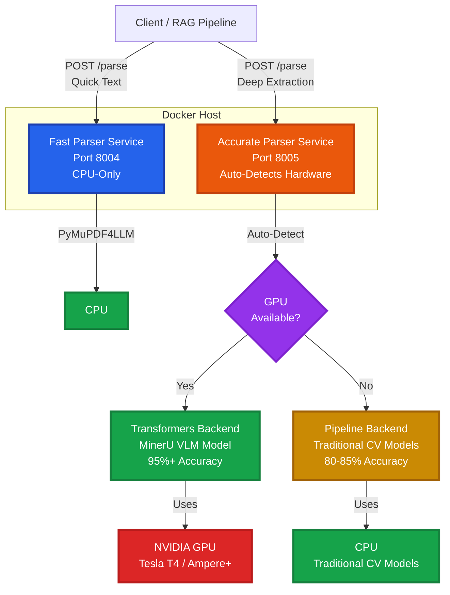

# Two-Tier Document Parser 📄🚀

[](https://www.gnu.org/licenses/agpl-3.0)
[](https://www.python.org/downloads/)
[](https://fastapi.tiangolo.com)
[](https://www.docker.com/)
[](https://github.com/opendatalab/MinerU)

A production-ready, **two-tier document parsing API** designed for RAG pipelines and data extraction workflows. It intelligently routes parsing requests to either a high-speed CPU-based parser or a high-accuracy VLM parser (with automatic CPU pipeline fallback when no GPU is available).

## Table of Contents

- [Features](#-features)
- [Quick Start](#-quick-start)
  - [Docker (Recommended)](#docker-recommended)
  - [Python Package](#python-package)
- [Architecture](#-architecture)
- [API Documentation](#-api-documentation)
- [Examples](#-examples)
- [Performance Benchmarks](#-performance-benchmarks)
- [FAQ](#-faq)
  - [Which parser should I use?](#which-parser-should-i-use)
  - [Can I use both parsers together?](#can-i-use-both-parsers-together)
  - [What happens if I don't have a GPU?](#what-happens-if-i-dont-have-a-gpu)
  - [What GPU do I need?](#what-gpu-do-i-need)
  - [GPU Configuration Guide](#gpu-configuration-guide)
  - [How do I scale this?](#how-do-i-scale-this)
  - [Is this production-ready?](#is-this-production-ready)
- [Troubleshooting](#-troubleshooting)
- [Documentation](#-documentation)
- [Future Improvements](#-future-improvements)
- [License](#-license)
- [Acknowledgements](#-acknowledgements)

---

## ✨ Features

| Feature | 🏎️ Fast Parser (Tier 1) | 🎯 Accurate Parser (Tier 2) |
| :--- | :--- | :--- |
| **Engine** | `PyMuPDF4LLM` | `MinerU` (VLM or Pipeline) |
| **Hardware** | CPU Only | GPU (VLM) or CPU (Pipeline) |
| **Auto Fallback** | N/A | ✅ Pipeline mode if no GPU |
| **Accuracy** | 70-75% | 95% (VLM) / 80-85% (Pipeline) |
| **Speed** | < 1s per page | 15s-60s (VLM) / 5-15s (Pipeline) |
| **Output** | Markdown Text | Markdown + Images + Tables + Formulas |
| **Best For** | High volume, simple text | Complex layouts, scanned docs, scientific papers |
| **Concurrency** | High (CPU-bound) | Medium (GPU-bound) / High (CPU fallback) |

---

## 🚀 Quick Start

### Docker (Recommended)

The easiest way to get started is using Docker Compose. **Both parsers work with or without GPU** - the accurate parser automatically detects hardware and adjusts accordingly.

```bash
# Clone the repository
git clone https://github.com/daddal001/two_tier_document_parser.git
cd two-tier-document-parser

# Start services (works with or without GPU)
docker-compose -f deploy/docker-compose.yml up --build -d

# Check service health
curl http://localhost:8004/health  # Fast parser
curl http://localhost:8005/health  # Accurate parser
```

**Note for CPU-only machines**: If Docker fails to start with a "nvidia runtime" error, see the [GPU Configuration Guide](#gpu-configuration-guide) below for CPU-only setup instructions.

Services will be available at:
- **Fast Parser**: `http://localhost:8004` (Swagger UI: `/docs`)
- **Accurate Parser**: `http://localhost:8005` (Swagger UI: `/docs`)
  - **With GPU**: VLM backend (95%+ accuracy)
  - **Without GPU**: Pipeline backend (80-85% accuracy)

### Python Package

Install as a Python package for development:

```bash
# Install the package
pip install -e .[fast]  # For fast parser only
pip install -e .[accurate]  # For accurate parser (works with or without GPU)

# Or install with all dependencies
pip install -e .[dev]
```

---

## 🏗️ Architecture



**Key Design Decisions:**
- **Two-tier approach**: Fast parser for simple documents, accurate parser for complex ones
- **Automatic GPU fallback**: Accurate parser detects hardware and selects optimal backend (Transformers or Pipeline)
- **Independent services**: Each parser runs in its own container for isolation
- **RESTful API**: Simple HTTP interface for easy integration
- **Docker-first**: Containerized deployment for consistency
- **Hardware agnostic**: Works on any hardware - CPU-only to high-end GPUs

---

## 📚 API Documentation

### Fast Parser API

**Endpoint**: `POST http://localhost:8004/parse`

**Request:**
```bash
curl -X POST "http://localhost:8004/parse" \
  -F "file=@document.pdf"
```

**Response:**
```json
{
  "markdown": "# Document Title\n\nContent here...",
  "metadata": {
    "pages": 10,
    "processing_time_ms": 5234,
    "parser": "pymupdf4llm",
    "version": "1.0.0"
  }
}
```

### Accurate Parser API

**Endpoint**: `POST http://localhost:8005/parse`

**Request:**
```bash
curl -X POST "http://localhost:8005/parse" \
  -F "file=@document.pdf" \
  --max-time 600
```

**Response:**
```json
{
  "markdown": "# Document Title\n\nContent with images, tables, and formulas...",
  "metadata": {
    "pages": 10,
    "processing_time_ms": 450000,
    "parser": "mineru",
    "backend": "transformers",
    "gpu_used": true,
    "accuracy_tier": "very-high",
    "version": "2.6.4",
    "filename": "document.pdf"
  },
  "images": [
    {
      "image_id": "page_1_img_0",
      "image_base64": "iVBORw0KGgo...",
      "page": 1,
      "bbox": [100, 200, 300, 400]
    }
  ],
  "tables": [
    {
      "table_id": "page_2_table_0",
      "markdown": "| Col1 | Col2 |\n|------|------|\n| Val1 | Val2 |",
      "page": 2,
      "bbox": [50, 100, 500, 300]
    }
  ],
  "formulas": [
    {
      "formula_id": "page_3_formula_0",
      "latex": "E = mc^2",
      "page": 3,
      "bbox": [200, 150, 300, 200]
    }
  ]
}
```

For complete API documentation, see [docs/API.md](docs/API.md) or visit the interactive Swagger UI at `/docs` on each service.

---

## 💡 Examples

### Python Client

```python
import requests

# Fast parsing (CPU)
def parse_fast(pdf_path: str) -> dict:
    with open(pdf_path, 'rb') as f:
        files = {'file': f}
        response = requests.post('http://localhost:8004/parse', files=files)
        return response.json()

# Accurate parsing (GPU)
def parse_accurate(pdf_path: str) -> dict:
    with open(pdf_path, 'rb') as f:
        files = {'file': f}
        # Note: Increase timeout for VLM processing
        response = requests.post(
            'http://localhost:8005/parse', 
            files=files, 
            timeout=6000
        )
        return response.json()

# Usage
result = parse_fast('document.pdf')
print(result['markdown'])

result = parse_accurate('complex_document.pdf')
print(f"Extracted {len(result['images'])} images")
print(f"Extracted {len(result['tables'])} tables")
```

### CLI Demo Client

We provide a professional CLI client with Rich UI:

```bash
# Install client dependencies
pip install rich requests

# Run the demo
python examples/demo_client.py examples/data/sample.pdf --mode fast
python examples/demo_client.py examples/data/sample.pdf --mode accurate --timeout 6000
```

### Jupyter Notebook

See `examples/notebooks/parser_visualization.ipynb` for an interactive example with visualizations.

---

## ⚡ Performance Benchmarks

| Metric | Fast Parser | Accurate Parser (GPU) | Accurate Parser (CPU) |
|--------|-------------|----------------------|------------------------|
| **Hardware** | CPU | Tesla T4 / Ampere+ | Any CPU (multi-core recommended) |
| **Backend** | PyMuPDF4LLM | Transformers (MinerU VLM) | Pipeline (OCR + CV Models) |
| **Latency per Page** | < 1s | 20-30s (T4) / 15-20s (Ampere+) | 30-60s |
| **Total Time (11 pages)** | ~8s | 8-10 min (T4) / 5-8 min (Ampere+) | 8-12 min |
| **Accuracy** | 70-75% | 95%+ | 80-85% |
| **Content Types** | Text only | Text + Images + Tables + Formulas | Text + Images + Tables + Formulas |
| **GPU Required** | ❌ No | ✅ Yes (optional) | ❌ No |
| **Auto-Fallback** | N/A | ✅ Falls back to CPU if no GPU | N/A |
| **Concurrent Requests** | High (CPU-bound) | Low-Medium (GPU-bound) | Medium (GPU-bound) |

**Hardware Notes:**
- **Fast Parser**: Scales with CPU cores (Python no-GIL mode enabled for true parallelism). Tested on 4-core systems.
- **Accurate Parser (GPU)**: 
  - **Tesla T4 / Turing GPUs (CC 7.5)**: Uses `transformers` backend for universal compatibility. VRAM configured for 15GB.
  - **Ampere+ GPUs (A10, A100, RTX 3090+, CC 8.0+)**: Also uses `transformers` backend (current implementation). Future vLLM engine support could provide 2-3x speedup.
- **Accurate Parser (CPU Fallback)**: Automatically uses `pipeline` backend with OCR and traditional CV models when no GPU detected. Performs comparably to GPU mode in time but uses different inference approach. Multi-core CPUs (8+ cores) recommended for better throughput.

---

## ❓ FAQ

### Which parser should I use?

- **Fast Parser**: Use for high-volume text extraction, simple documents, or when speed is critical
- **Accurate Parser**: Use for complex layouts, scientific papers, documents with tables/formulas, or when accuracy is paramount

### Can I use both parsers together?

Yes! Many production systems use both:
- Fast parser for initial processing and filtering
- Accurate parser for complex documents that need detailed extraction

### What happens if I don't have a GPU?

The **accurate parser automatically detects GPU availability** and falls back gracefully - **no code or configuration changes needed**:

| GPU Status | Backend Used | Accuracy | Speed | Use Case |
|:-----------|:-------------|:---------|:------|:---------|
| ✅ GPU Available | Transformers (MinerU VLM) | 95%+ | 15-60s/page | Highest accuracy |
| ❌ No GPU | Pipeline (CPU) | 80-85% | 5-15s/page | Good accuracy without GPU |

**Key Benefits:**
- ✅ **Fully automatic detection** - no environment variables or config files to edit
- ✅ Service starts successfully on any hardware
- ✅ Check `metadata.backend` and `metadata.gpu_used` in API response to see which mode was used
- ✅ Pipeline mode still extracts images, tables, and formulas using traditional CV models
- ✅ Same API interface regardless of backend

**Docker Note**: On machines without NVIDIA drivers, you may need to comment out `runtime: nvidia` in `deploy/docker-compose.yml` if Docker fails to start the container. The Python service will still auto-detect and use CPU mode.

### What GPU do I need?

**GPU is completely optional!** Both parsers work on any hardware:

- **Fast Parser**: Always uses CPU (no GPU needed)
- **Accurate Parser**: 
  - ✅ **Automatically detects and adapts** to available hardware
  - With GPU: Uses VLM mode (95%+ accuracy) - NVIDIA Tesla T4, A10, A100, RTX 3090+
  - Without GPU: Uses Pipeline mode (80-85% accuracy) - any CPU

No configuration changes needed - the service detects GPU availability at startup and selects the optimal backend automatically.

### GPU Configuration Guide

If you want to optimize Docker settings for your specific GPU, here's a comprehensive configuration guide:

| Hardware | Backend | Docker Runtime | GPU VRAM Required | System RAM (Docker Memory) | Virtual VRAM Setting | Expected Performance | Docker Changes Needed |
|:---------|:--------|:---------------|:------------------|:--------------------------|:---------------------|:--------------------|:---------------------|
| **Tesla T4 / Turing (CC 7.5)** | Transformers (MinerU VLM) | `runtime: nvidia` | 8-16 GB<br/>(T4 has 16GB) | `16G` (min)<br/>`32G` (recommended) | `MINERU_VIRTUAL_VRAM_SIZE=15` | 95%+ accuracy<br/>~20-30s/page | ✅ Keep GPU config as-is<br/>💡 Optional: Increase RAM to 32G |
| **Ampere+ (A10/A100/RTX 3090+)** | Transformers (MinerU VLM) | `runtime: nvidia` | 8-24 GB<br/>(A10: 24GB, A100: 40/80GB) | `16G` (min)<br/>`32G` (recommended) | `MINERU_VIRTUAL_VRAM_SIZE=20-32` | 95%+ accuracy<br/>~15-20s/page | ✅ Keep GPU config<br/>💡 Optional: Increase RAM/VRAM |
| **CPU Only (No GPU)** | Pipeline (CPU) | ❌ Comment out | N/A (no GPU) | `8G` (min)<br/>`16-32G` (better performance) | N/A | 80-85% accuracy<br/>~30-60s/page | ⚠️ Comment out `runtime: nvidia`<br/>⚠️ Comment out `devices` section |

**Understanding the Settings:**
- **GPU VRAM Required**: Video memory on the GPU chip (hardware specification)
- **System RAM (Docker Memory)**: Host system memory allocated to the Docker container
- **Virtual VRAM Setting**: `MINERU_VIRTUAL_VRAM_SIZE` tells MinerU how much GPU VRAM to use (set slightly below physical VRAM to leave buffer)

**Quick Setup by Hardware:**

<details>
<summary><b>🔧 Tesla T4 / Turing GPUs (Compute Capability 7.5)</b></summary>

**Current configuration is already optimized for Tesla T4!** No changes needed.

Your `docker-compose.yml` already has:
```yaml
environment:
  - MINERU_VIRTUAL_VRAM_SIZE=15
  - CUDA_VISIBLE_DEVICES=0
  - TOKENIZERS_PARALLELISM=false
deploy:
  resources:
    limits:
      memory: 16G
```

**Why these settings:**
- VRAM 15GB: Optimal for T4's 16GB memory
- Transformers backend: Most stable for Turing architecture
- Memory 16GB: Sufficient for VLM processing

</details>

<details>
<summary><b>⚡ Ampere+ GPUs (A10, A100, RTX 3090+)</b></summary>

**Optional optimization for more VRAM:**

Edit `deploy/docker-compose.yml`:
```yaml
environment:
  - MINERU_VIRTUAL_VRAM_SIZE=20  # Increase from 15 to 20+
  - CUDA_VISIBLE_DEVICES=0
  - TOKENIZERS_PARALLELISM=false
deploy:
  resources:
    limits:
      memory: 24G  # Increase from 16G
```

**Performance gains:**
- Larger batch sizes
- Faster processing (~15-20s/page vs 20-30s)
- Better handling of large documents

</details>

<details>
<summary><b>💻 CPU-Only Deployment (No GPU)</b></summary>

**Service auto-detects and uses pipeline backend.** Only Docker config needs adjustment:

Edit `deploy/docker-compose.yml` and comment out GPU settings:
```yaml
accurate-parser:
  # ... other settings ...
  restart: unless-stopped
  # runtime: nvidia  # ← Comment this out
  deploy:
    resources:
      limits:
        cpus: '2'
        memory: 8G  # Reduced from 16G
      reservations:
        cpus: '1'
        memory: 4G
        # devices:  # ← Comment out entire section
        #   - driver: nvidia
        #     count: 1
        #     capabilities: [gpu]
```

**No environment variable changes needed** - Python service auto-detects CPU mode.

</details>

### How do I scale this?

- **Fast Parser**: Scale horizontally (multiple containers) since it's CPU-bound
- **Accurate Parser**: Scale vertically (better GPU) or use multiple GPU instances

### Is this production-ready?

Yes! The codebase is designed for production use with:
- Health checks
- Error handling
- Structured logging
- Docker deployment
- API documentation

---

## 🛠️ Troubleshooting

### 1. `RuntimeError: too many resources requested for launch`

**Cause**: Using vLLM backend on a Tesla T4 GPU.

**Fix**: The default configuration uses `transformers` backend which is stable on T4. Ensure you haven't manually forced `vllm-engine`.

### 2. `ReadTimeout` Error

**Cause**: VLM processing takes time (up to 10 mins on T4).

**Fix**: Increase your client timeout:
```python
response = requests.post('http://localhost:8005/parse', files=files, timeout=600)
```

### 3. GPU not detected

**Cause**: Docker may not have GPU access configured.

**Fix**: Ensure NVIDIA Container Toolkit is installed and Docker Compose has GPU runtime configured. See [docs/DOCKER_SETUP.md](docs/DOCKER_SETUP.md) for details.

### 4. Out of memory errors

**Cause**: GPU memory exhausted during VLM processing.

**Fix**: Reduce `MINERU_VIRTUAL_VRAM_SIZE` in docker-compose.yml or use a GPU with more memory.

For more troubleshooting, see [docs/DOCKER_SETUP.md](docs/DOCKER_SETUP.md).

---

## 📖 Documentation

- **[API Reference](docs/API.md)**: Complete API documentation
- **[Docker Setup](docs/DOCKER_SETUP.md)**: Detailed Docker configuration and troubleshooting
- **[Setup Guide](docs/SETUP_GUIDE.md)**: Step-by-step setup instructions
- **[Testing Guide](docs/TESTING.md)**: Testing procedures and benchmarks
- **[Git Submodules](docs/GIT_SUBMODULES.md)**: Managing MinerU submodule

---

## 📄 License

This project is licensed under the **AGPL-3.0 License** due to dependencies on MinerU and PyMuPDF. See [LICENSE](LICENSE) for details.

## 🚀 Future Improvements

- **vLLM Engine Support**: Add vLLM engine backend for Ampere+ GPUs (A10, A100, RTX 3090+) to achieve 2-3x faster inference compared to Transformers backend. Currently uses Transformers for universal compatibility with Tesla T4/Turing GPUs.
- **Batch Processing API**: Support multiple document uploads in a single request
- **Streaming Responses**: Stream parsing results for large documents
- **Multi-GPU Support**: Distribute processing across multiple GPUs
- **Model Caching**: Optimize model loading for faster cold starts

## 🤝 Acknowledgements

This project builds upon excellent open-source software:

- **[MinerU](https://github.com/opendatalab/MinerU)** (AGPL-3.0) - State-of-the-art multimodal document parsing with VLM
- **[PyMuPDF](https://github.com/pymupdf/PyMuPDF)** (AGPL-3.0) - Lightning-fast PDF text extraction
- **[vLLM](https://github.com/vllm-project/vllm)** (Apache-2.0) - High-performance LLM inference engine
- **[Transformers](https://github.com/huggingface/transformers)** (Apache-2.0) - State-of-the-art ML models and inference
- **[FastAPI](https://github.com/tiangolo/fastapi)** (MIT) - Modern, fast web framework for building APIs
- **[Uvicorn](https://github.com/encode/uvicorn)** (BSD-3-Clause) - Lightning-fast ASGI server

See [NOTICE](NOTICE) for complete licensing information.

---
